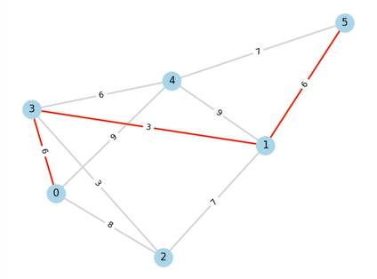
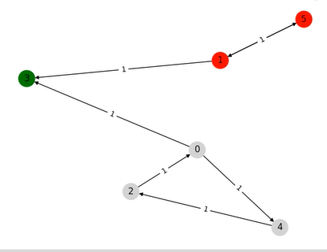
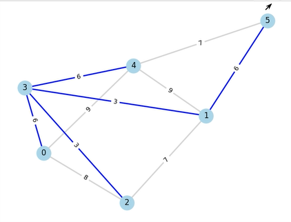

# Visualizador de Grafos

Ferramenta educacional para visualizar o resultado de algoritmos em grafos.

O objetivo deste projeto é combinar a eficiência de implementações em C++ (loop do menu, algoritmos clássicos em grafos) com o ecossistema de visualização do Python (matplotlib, networkx). A ponte entre as duas linguagens foi feita usando a API do CPython (`Python.h`).

---

## Funcionalidades

* Implementações de algoritmos em grafos (ex.: Dijkstra, Kosaraju, Kruskal) em C++ visando desempenho.
* Loop de menu e lógica principal em C++ para execução interativa/por linha de comando.
* Visualização dos resultados (plot de grafo, destaque de caminhos/arestas, etc.) em Python usando `matplotlib` e `networkx`.
* Ponte C++ ↔ Python feita com a API do CPython (`Python.h`) para chamar o código Python a partir do executável em C++.

---

## Dependências

* **C++**: compilador compatível com C++23 (g++, clang, MSVC recente).
* **Python 3** (preferência >= 3.8).
* **Bibliotecas Python**:

  * `matplotlib`
  * `networkx`
* **Cabeçalhos de desenvolvimento do Python** (ex.: `python3-dev` / `python3-devel`) — necessários para usar `Python.h` e linkar contra a API do CPython.

## Instalação (rápido)

```bash
pip install -r requirements.txt
```

> Certifique-se de ter as bibliotecas de desenvolvimento do Python instaladas no seu sistema (por exemplo `sudo apt install python3-dev` em Debian/Ubuntu) para compilar o binário C++ que usa `Python.h`.

---

## Compilação

O projeto já inclui um **Makefile**. Para compilar tudo, basta executar:

```bash
cd src
make all
```

O Makefile cuida automaticamente de:

* Compilar o código C++ com suporte a **C++23**.
* Incluir e linkar corretamente a API do CPython (`Python.h` + libs).
* Gerar o executável final do visualizador.

Se desejar recompilar do zero:

```bash
make clean
make all
```

---

## Uso (exemplos)

Basta executar o executável do código em C++ e escolher as opções desejadas no menu.

```bash
./run_grafo
```
Alguns exemplos de imagens geradas pelo programa:





---
## Contribuindo

Contribuições são bem-vindas!

* Abra uma issue para discutir grandes mudanças ou bugs.
* Para contributions pequenas: faça um fork, crie uma branch, adicione testes/exemplos e abra um PR.