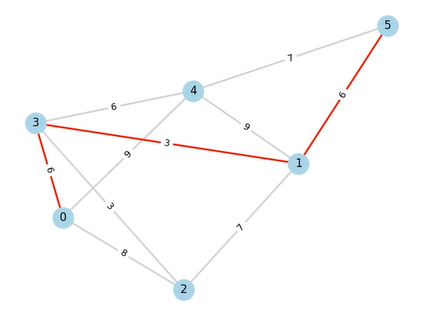
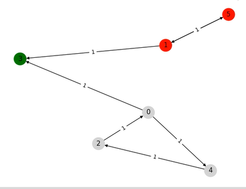
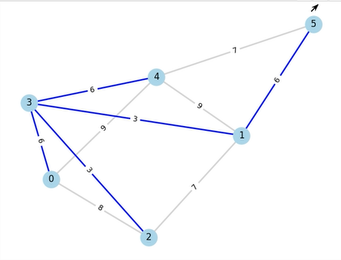

-----

# Graph Visualizer

An educational tool designed to visualize the results of various graph algorithms.

The goal of this project is to combine the efficiency of **C++** implementations (menu loops, classic graph algorithms) with the robust visualization ecosystem of **Python** (`matplotlib`, `networkx`). The bridge between the two languages is established using the **CPython API** (`Python.h`).

-----

## Features

  * **Performance-focused C++**: Core graph algorithms (e.g., Dijkstra, Kosaraju, Kruskal) implemented in C++.
  * **Interactive CLI**: Main logic and menu loop handled in C++ for command-line execution.
  * **Python Visualization**: Results are plotted using `matplotlib` and `networkx` to highlight paths, edges, and clusters.
  * **C++/Python Integration**: Direct calls to Python code from the C++ executable via the CPython API (`Python.h`).

-----

## Dependencies

  * **C++**: A C++23 compatible compiler (g++, clang, or recent MSVC).
  * **Python 3**: (Version 3.8 or higher preferred).
  * **Python Libraries**:
      * `matplotlib`
      * `networkx`
  * **Python Development Headers**: (e.g., `python3-dev` / `python3-devel`) — Required to use `Python.h` and link against the CPython API.

## Installation (Quick Start)

```bash
pip install -r requirements.txt
```

> **Note:** Ensure you have the Python development libraries installed on your system (e.g., `sudo apt install python3-dev` on Debian/Ubuntu) to compile the C++ binary that interfaces with `Python.h`.

-----

## Compilation

The project includes a **Makefile**. To compile the entire project, simply run:

```bash
cd src
make all
```

The Makefile automatically handles:

  * Compiling the C++ code with **C++23** support.
  * Correctly including and linking the CPython API (`Python.h` + libraries).
  * Generating the final visualizer executable.

To recompile from scratch:

```bash
make clean
make all
```

-----

## Usage

Simply run the C++ executable and follow the on-screen menu instructions.

```bash
./run_grafo
```

### Visualization Examples

Below are examples of images generated by the program:







-----

## Contributing

Contributions are welcome\!

  * **Bugs & Major Changes**: Please open an issue first to discuss your ideas.
  * **Minor Contributions**: Feel free to fork the repository, create a branch, add your tests or examples, and submit a Pull Request.

-----
